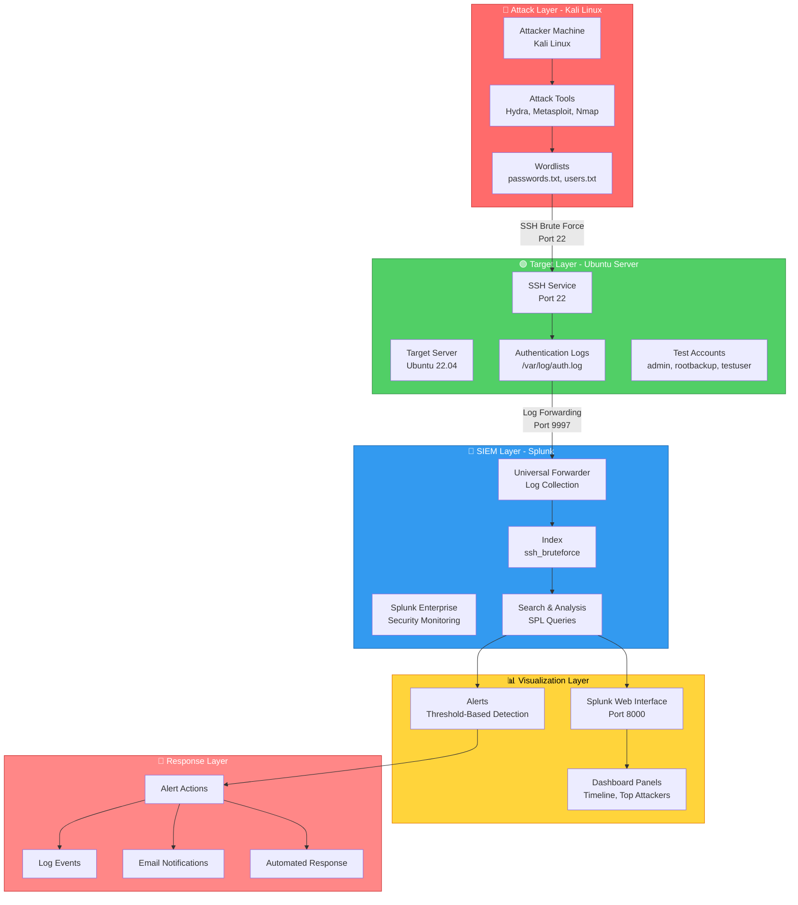
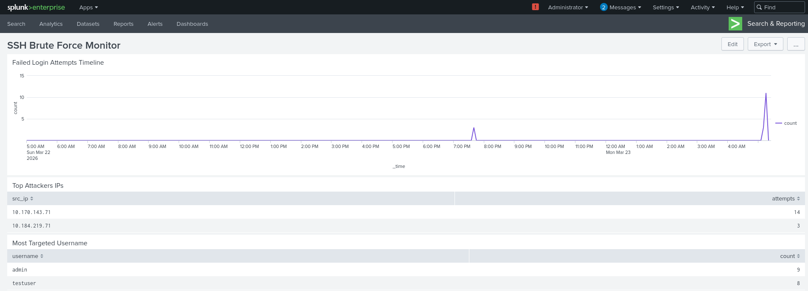
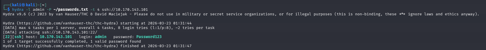
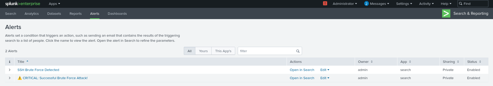
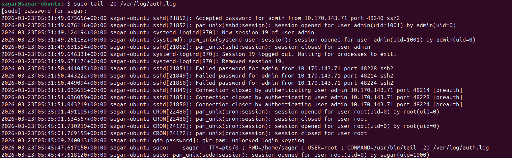

# 🔐 SSH Brute Force Detection System with Splunk SIEM

## 📋 Project Overview
This project implements a complete Security Information and Event Management (SIEM) solution to detect, visualize, and alert on SSH brute force attacks in real-time. The system simulates real-world attacks using Kali Linux and monitors them using Splunk Enterprise.

## 🎯 Project Goals
- ✅ Detect SSH brute force attacks in real-time
- ✅ Visualize attack patterns and trends
- ✅ Create automated alerts for suspicious activity
- ✅ Simulate realistic attack scenarios
- ✅ Build a portfolio-worthy security project

## Architecture Diagram



## 🛠️ Technologies Used

| Category | Tools |
|----------|-------|
| **Attacker** | Kali Linux, Hydra, Metasploit, Nmap, Python |
| **Target** | Ubuntu Server 22.04, OpenSSH, Rsyslog |
| **SIEM** | Splunk Enterprise 9.0.4 |
| **Analysis** | SPL (Splunk Processing Language) |
| **Virtualization** | VirtualBox/VMware |

## 📊 Features

### 🔴 Attack Simulation
- **Hydra Brute Force**: Fast and slow password guessing attacks
- **Metasploit Integration**: Professional penetration testing framework
- **Custom Python Scripts**: Varied attack patterns (slow, fast, random)
- **Multiple Attack Vectors**: Single user, multiple users, password spraying

### 🛡️ Detection & Monitoring
- **Real-time Log Collection**: Splunk monitors `/var/log/auth.log`
- **Custom Dashboard**: 5+ visualization panels
- **Threshold-based Alerts**: Automated detection of suspicious patterns

### 📈 Splunk Dashboard Panels
1. **Failed Login Timeline** - Visualize attack intensity over time
2. **Top Attacker IPs** - Identify malicious sources
3. **Most Targeted Usernames** - Track credential targeting
4. **Recent Failed Attempts** - Real-time event monitoring
5. **Successful Logins Alert** - Detect potential breaches

### ⚠️ Alert Rules
| Alert | Trigger | Action |
|-------|---------|--------|
| Brute Force Detection | >5 failures in 5 minutes | Log event, Email notification |
| Successful Breach | Failures then success in 10 mins | Critical alert |
| High Volume Attack | >50 attempts in 1 minute | High severity alert |

## 📸 Screenshots

### Real-time SSH Brute Force Detection in Action



*Splunk dashboard successfully detecting a brute force attack:*
- **Attack Spike:** Up to **15 failed login attempts** detected
- **Attacker IP:** `10.170.143.71` identified
- **Targeted Account:** `admin` account under attack
- **Timeline:** Multiple attack spikes visible across monitoring period

This demonstrates the system's ability to:
1. Detect brute force attempts in real-time
2. Identify attacking IP addresses
3. Track targeted user accounts
4. Visualize attack patterns over time

### Hydra Brute Force Attack Simulation



*Launching a brute force attack from Kali Linux using Hydra. The attack successfully discovers the admin password `Password123`, demonstrating a realistic attack scenario.*

### Splunk Alerts Configuration

*Automated alerts configured for brute force and successful breach detection*

### Raw Authentication Logs

*Ubuntu /var/log/auth.log showing failed password attempts*

## 🚀 Installation & Setup Guide

### Prerequisites
- VirtualBox/VMware installed
- 8GB RAM minimum
- 40GB free disk space
- Internet connection

---

### 1️⃣ Target Server Setup (Ubuntu 22.04)

```bash
# Update system
sudo apt update && sudo apt upgrade -y

# Install SSH Server
sudo apt install openssh-server -y

# Create test user accounts (honeypot accounts)
sudo useradd -m admin
sudo useradd -m rootbackup
sudo useradd -m testuser

# Set weak passwords (for testing)
echo "admin:Password123" | sudo chpasswd
echo "rootbackup:Welcome1" | sudo chpasswd
echo "testuser:testpass" | sudo chpasswd

# Enable verbose SSH logging
sudo sed -i 's/#LogLevel INFO/LogLevel VERBOSE/' /etc/ssh/sshd_config
sudo systemctl restart ssh

# Verify SSH is running
sudo systemctl status ssh
```

---

### 2️⃣ Splunk Installation (On Target Server or Separate VM)

```bash
# Download Splunk Enterprise 9.0.4
wget -O splunk.deb 'https://download.splunk.com/products/splunk/releases/9.0.4/linux/splunk-9.0.4-de405f4a7979-linux-2.6-amd64.deb'

# Install Splunk
sudo dpkg -i splunk.deb

# Start Splunk and accept license
sudo /opt/splunk/bin/splunk start --accept-license

# Create admin credentials when prompted:
#   Username: admin
#   Password: [choose a strong password]

# Enable Splunk to start on boot
sudo /opt/splunk/bin/splunk enable boot-start

# Add SSH log monitoring
sudo /opt/splunk/bin/splunk add monitor /var/log/auth.log -index main -sourcetype linux_secure

# Create dedicated index for SSH logs
sudo /opt/splunk/bin/splunk add index ssh_bruteforce

# Verify Splunk is running
sudo /opt/splunk/bin/splunk status
```

---

### 3️⃣ Attacker Machine Setup (Kali Linux)

```bash
# Update system
sudo apt update && sudo apt upgrade -y

# Install attack tools
sudo apt install hydra metasploit-framework nmap -y

# Install Python libraries for custom scripts
sudo apt install python3-pip -y
pip3 install paramiko

# Create password wordlist
cat > ~/passwords.txt << 'EOF'
123456
password
admin
Password123
Welcome1
root
toor
qwerty
letmein
admin123
root123
testpass
EOF

# Create username wordlist
cat > ~/users.txt << 'EOF'
admin
root
testuser
rootbackup
oracle
postgres
ubuntu
EOF

# Test connection to target (replace with your Ubuntu IP)
ping -c 4 10.184.219.101
```

---

### 4️⃣ Splunk Dashboard Configuration

#### Create Index
1. Login to Splunk Web: `https://[YOUR_IP]:8000`
2. Click **Settings** → **Indexes** → **New Index**
3. Name: `ssh_bruteforce`
4. Click **Save**

#### Add Dashboard Panels

**Panel 1: Failed Login Timeline**
```spl
index=ssh_bruteforce "Failed password" 
| timechart count span=5m
```

**Panel 2: Top Attacker IPs**
```spl
index=ssh_bruteforce "Failed password" 
| rex "from (?<src_ip>\d+\.\d+\.\d+\.\d+)" 
| stats count as attempts by src_ip 
| sort - attempts 
| head 10
```

**Panel 3: Most Targeted Usernames**
```spl
index=ssh_bruteforce "Failed password" 
| rex "for (?<username>\w+)" 
| stats count by username 
| sort - count
```

**Panel 4: Recent Failed Attempts**
```spl
index=ssh_bruteforce "Failed password" 
| table _time, src_ip, username
| sort - _time
| head 20
```

**Panel 5: Successful Logins (Critical)**
```spl
index=ssh_bruteforce "Accepted password" 
| table _time, user, src_ip
| sort - _time
```

---

### 5️⃣ Launch Brute Force Attacks

```bash
# On Kali Linux, replace with your Ubuntu IP
TARGET_IP="10.184.219.101"

# Attack 1: Single user with password list
hydra -l admin -P ~/passwords.txt -t 4 ssh://$TARGET_IP

# Attack 2: Multiple users with single password (Password Spraying)
hydra -L ~/users.txt -p password123 -t 4 ssh://$TARGET_IP

# Attack 3: Full brute force
hydra -L ~/users.txt -P ~/passwords.txt -t 4 ssh://$TARGET_IP

# Attack 4: Slow attack (1 attempt every 5 seconds)
hydra -l admin -P ~/passwords.txt -t 1 -w 5 ssh://$TARGET_IP
```

---

### 6️⃣ Create Alerts

#### Alert 1: Brute Force Detection
```spl
index=ssh_bruteforce "Failed password" 
| bucket _time span=5m 
| stats count as failed_attempts by src_ip, _time 
| where failed_attempts > 5
```

#### Alert 2: Successful Breach Detection
```spl
index=ssh_bruteforce 
| transaction src_ip maxspan=10m 
| where mvcount('Failed password') > 3 AND mvcount('Accepted password') > 0
| table src_ip, _time, mvcount('Failed password') as failed_count, mvcount('Accepted password') as success_count
```

---

### 7️⃣ Verification Commands

```bash
# Check if Splunk is receiving logs
sudo /opt/splunk/bin/splunk search "index=ssh_bruteforce" -auth admin:password

# Check auth.log on target
sudo tail -f /var/log/auth.log

# Check Splunk status
sudo /opt/splunk/bin/splunk status

# List monitored files
sudo /opt/splunk/bin/splunk list monitor -auth admin:password
```
| transaction src_ip maxspan=10m 
| where mvcount('Failed password') > 3 AND mvcount('Accepted password') > 0
| table src_ip, _time, failed_count, success_co

## 📋 Quick Reference

| Component | IP/Port | Purpose |
|-----------|---------|---------|
| Kali Linux | 10.184.219.100 | Attacker machine |
| Ubuntu Target | 10.184.219.101 | SSH server + Splunk |
| Splunk Web | Port 8000 | Dashboard & Alerts |
| Splunk Forward | Port 9997 | Log ingestion |
| SSH Service | Port 22 | Target service |

### Default Credentials
| Account | Username | Password |
|---------|----------|----------|
| Splunk Admin | admin | [your password] |
| Ubuntu Admin | admin | Password123 |
| Ubuntu Test | testuser | testpass |
| Ubuntu Backup | rootbackup | Welcome1 |

## 📝 License

This project is licensed under the MIT License - see the [LICENSE](LICENSE) file for details.
